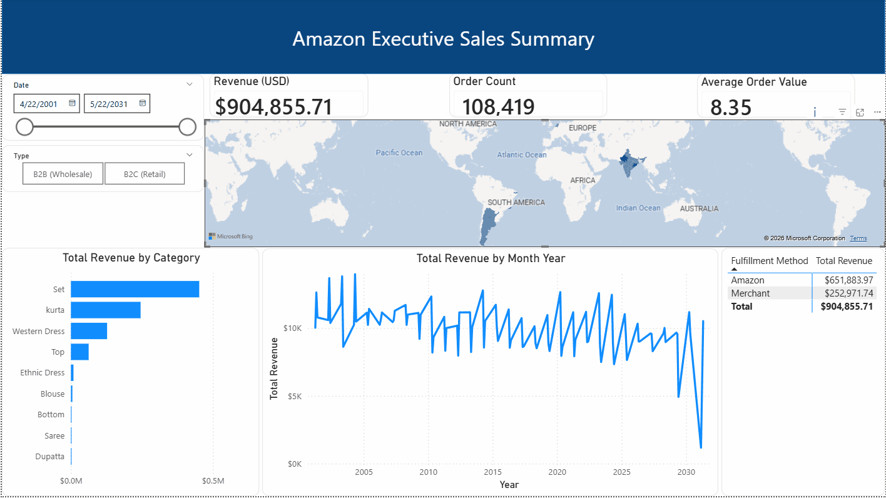

# Data-Pipeline-Dashboard-Project
This is an example of taking raw data from a public source, performing ETL within MSSQL, and then creating an executive dashboard within Power BI.

### Dashboard Preview

This is the Kaggle dataset being utilized for this project: https://www.kaggle.com/datasets/thedevastator/unlock-profits-with-e-commerce-sales-data?resource=download 
